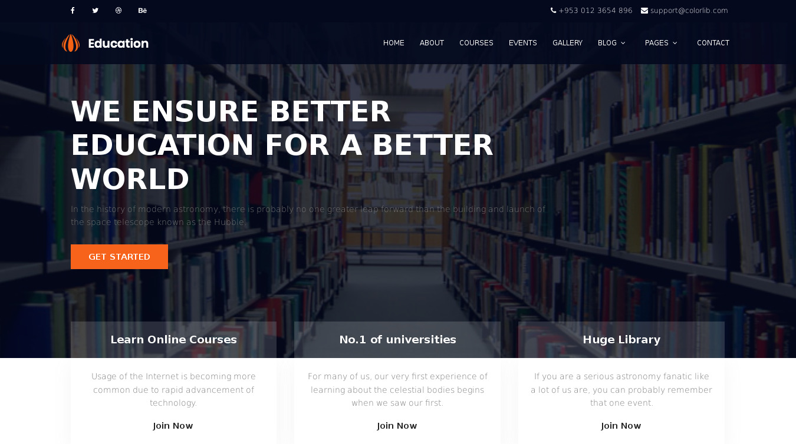

## education-master template HTML CSS JS , Bahan Template Untuk Materi SLiMS Commeet Up 2018 di Surabaya

Ini adalah template web yang dibuat menggunakan html, css , js dan gambar. Gambar digunakan untuk hiasan gambar `` dan juga untuk background css. CSS adalah Casscading Style Sheet yang digunakan untuk mengatur desain nya. HTML Hiper Text MarkUp Language adalah bahasa penanda. Sedangkan JS Java Script digunakan untuk aksi tampilan misal nya slider , atau animasi.

### Tugas Buat Template Ini menjadi template PHP 

1. Buka file **index.html** menggunakan sublimetext atau visualcode studio
2. Pisah per `<section></section>`
3. Simpan per section itu dengan nama *class* nya simpan file dengan ekstensi **.php** taruh dalam directory yang sama
4. Buat file index.php dengan code yang ter include file file divisi php , misal seperti berikut

```php
    <?php
    include 'header.php';
    include 'meta.php';
    include 'nav.php';
    include 'main.php';
    ?>
```
5. Panggil pada browser untuk melihat hasil nya



### Dimodifikasi &  Di-Push Ke GitHUb Oleh

Template ini asli dibuat oleh [ColorLib](https://colorlib.com/) dimodifikasi oleh [Zaemakhus](https://github.com/desawarna) untuk pelatihan *SLiMS Template Development*

### Template Versi PHP

Template Versi PHP dapat anda download di [https://github.com/slimscommeet/bpphp-scu8](https://github.com/slimscommeet/bpphp-scu8)